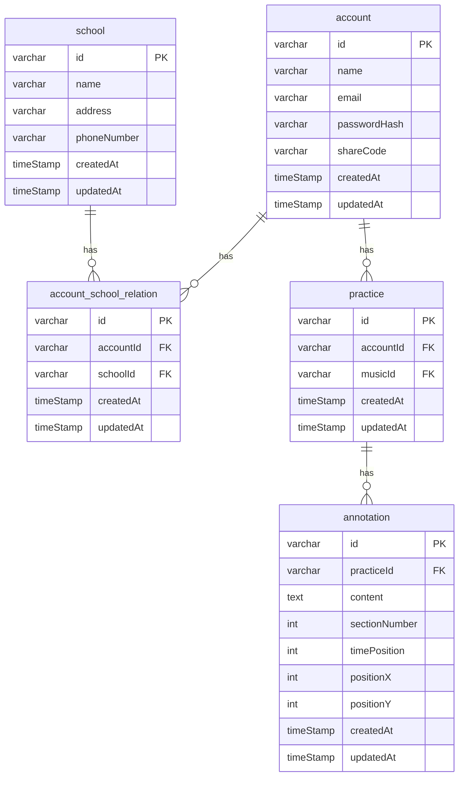

## ERD

```mermaid
erDiagram
    account ||--o{ account_school_relation: "has"
    school ||--o{ account_school_relation: "has"
    account ||--o{ practice: "has"
    practice ||--o{ annotation: "has"

    account {
        varchar id PK 
        varchar name 
        varchar email 
        varchar passwordHash 
        varchar shareCode 
        timeStamp createdAt 
        timeStamp updatedAt 
    }

    account_school_relation {
        varchar id PK
        varchar accountId FK
        varchar schoolId FK
        timeStamp createdAt 
        timeStamp updatedAt 
    }

    school {
        varchar id PK
        varchar name 
        varchar address 
        varchar phoneNumber 
        timeStamp createdAt 
        timeStamp updatedAt 
    }

    practice {
        varchar id PK
        varchar accountId FK
        varchar musicId FK
        timeStamp createdAt 
        timeStamp updatedAt
    }
    
    annotation {
        varchar id PK
        varchar practiceId FK
        text content
        int sectionNumber
        int timePosition
        int positionX
        int positionY
        timeStamp createdAt 
        timeStamp updatedAt
    }
```