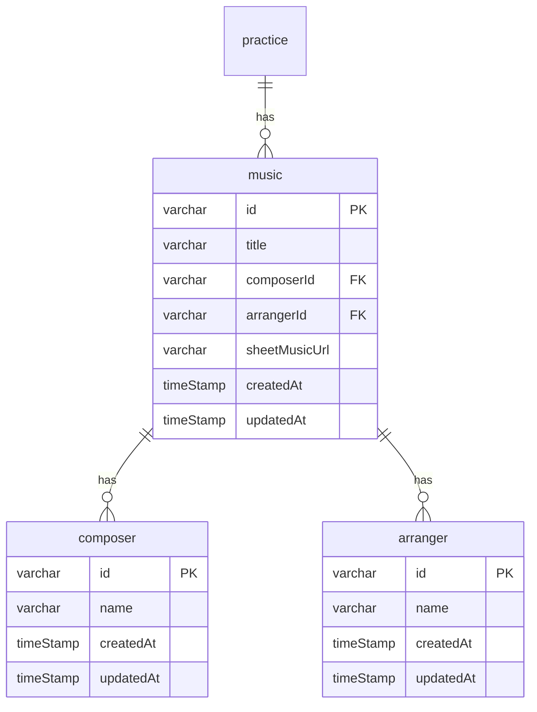

## ERD

```mermaid
erDiagram
    practice ||--o{ music : "has"
    music ||--o{ composer : "has"
    music ||--o{ arranger : "has"
    
    music {
        varchar id PK
        varchar title 
        varchar composerId FK
        varchar arrangerId FK 
        varchar sheetMusicUrl
        timeStamp createdAt 
        timeStamp updatedAt 
    }

    composer {
        varchar id PK
        varchar name 
        timeStamp createdAt 
        timeStamp updatedAt 
    }
    
    arranger {
        varchar id PK
        varchar name 
        timeStamp createdAt 
        timeStamp updatedAt 
    }

```