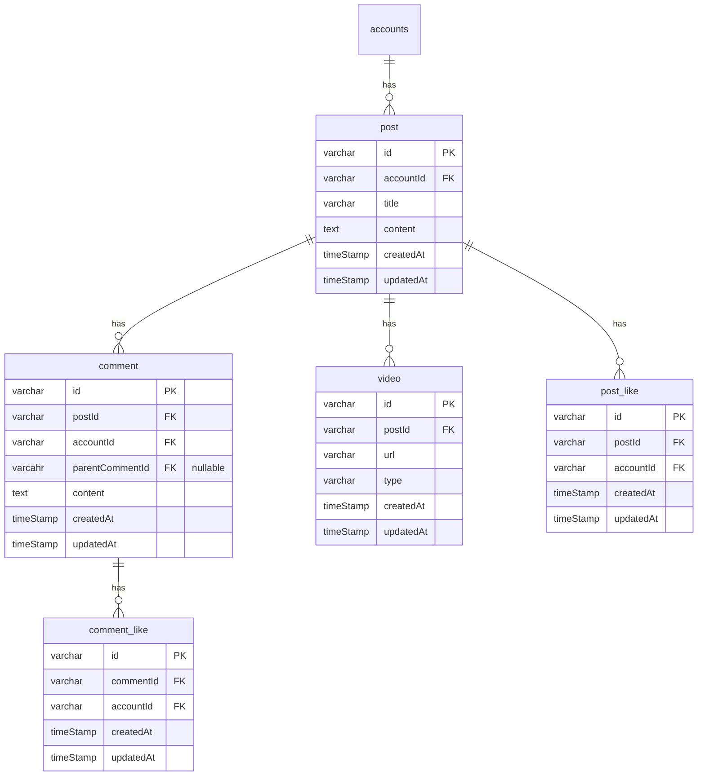

# ERD

```mermaid
erDiagram
    accounts ||--o{ post: "has"
    post ||--o{ comment: "has"
    post ||--o{ video: "has"
    post ||--o{ post_like: "has"
    comment ||--o{ comment_like: "has"
    
    post {
        varchar id PK
        varchar accountId FK
        varchar title
        text content
        timeStamp createdAt
        timeStamp updatedAt
    }

    post_like {
        varchar id PK
        varchar postId FK
        varchar accountId FK
        timeStamp createdAt
        timeStamp updatedAt
    }

    comment_like {
        varchar id PK
        varchar commentId FK
        varchar accountId FK
        timeStamp createdAt
        timeStamp updatedAt
    }

    comment {
        varchar id PK
        varchar postId FK
        varchar accountId FK
        varcahr parentCommentId FK "nullable"
        text content
        timeStamp createdAt
        timeStamp updatedAt
    }

    video {
        varchar id PK
        varchar postId FK
        varchar url
        varchar type
        timeStamp createdAt
        timeStamp updatedAt
    }


```