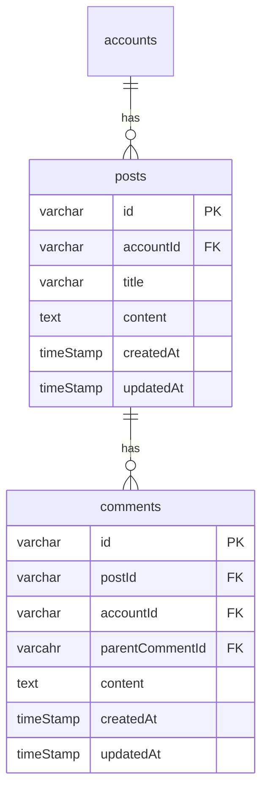

# ERD

```mermaid
erDiagram
    accounts ||--o{ posts: "has"
    posts ||--o{ comments: "has"
    
    posts {
        varchar id PK
        varchar accountId FK
        varchar title
        text content
        timeStamp createdAt
        timeStamp updatedAt
    }

    comments {
        varchar id PK
        varchar postId FK
        varchar accountId FK
        varcahr parentCommentId FK
        text content
        timeStamp createdAt
        timeStamp updatedAt
    }


```