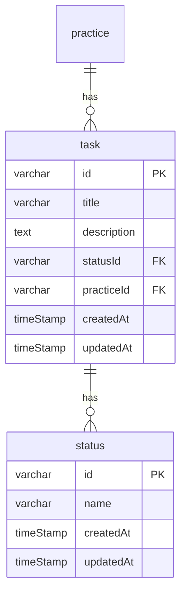

# ERD

```mermaid
erDiagram

    task ||--o{ status: "has"
    practice ||--o{ task: "has"

    task {
        varchar id PK
        varchar title
        text description
        varchar statusId FK
        varchar practiceId FK
        timeStamp createdAt
        timeStamp updatedAt
    }

    status {
        varchar id PK
        varchar name
        timeStamp createdAt
        timeStamp updatedAt
    }

```