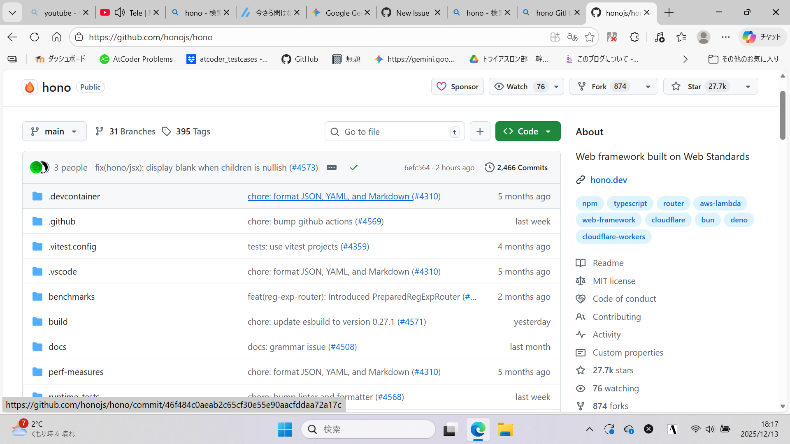
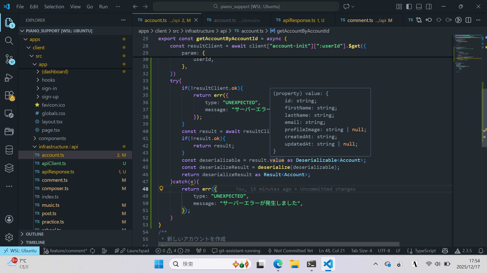
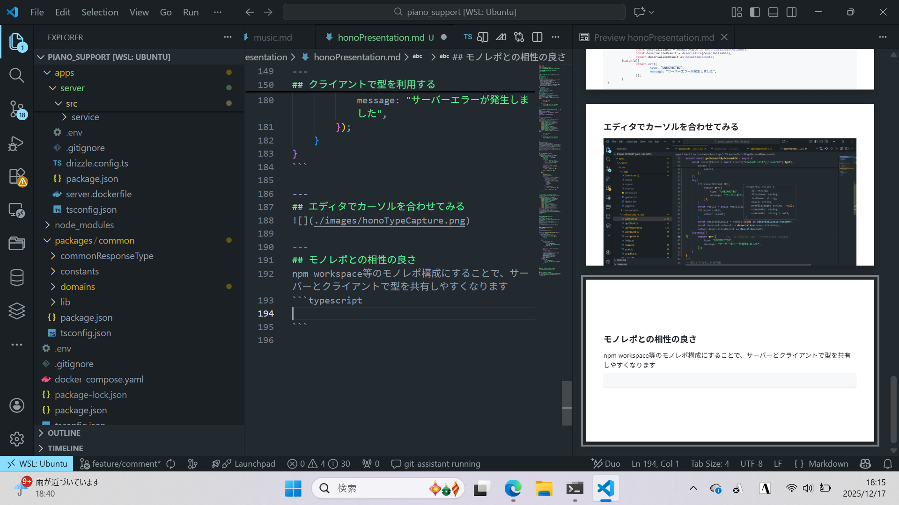

# HonoRPCで実現するフルスタック型安全
nararaki
---
---

## Honoについて
### 作者
yusukebeさん(日本人)
### 特徴
- typescript向けAPI設計向けwebフレームワーク
- 高速なルーティング、軽量さが特徴
- expressの代替になっていく
- node.js,bun,deno等のマルチランタイム対応
- 設計思想がweb標準API向け
- cloudflare workersとの相性が最高(起動が速い)
- 関数型の考え方がよく取り入られている
---
### そのほか
- github スター数27.7k
- カンファレンスもある

---
## 使ってみた
### まずはAPIサーバーを起動する
```typescript
import { serve } from "@hono/node-server";
import { Hono } from "hono";
const app = new Hono().route("/",apiRoutes)
serve(
	{
		fetch: app.fetch,
		port: 8000,
	},
	(info) => {
		console.log(`Server is running on http://localhost:${info.port}`);
	},
);
```
---
# 注目ポイント1: 関数型の考え方が取り入れられている
ここでHono.routeの引数が
**route(path: "/", app: Hono<Env, Schema, string>**
となっている所注目ポイントです
---
---
### APIのルーティングを作る
```typescript
import { serve } from "@hono/node-server";
import { Hono } from "hono";
export const apiRoutes = new Hono()
	.route("/account-init", accountRoute)
	.route("/school-init", schoolRoute)
	.route("/school", schoolRoute)
	.route("/enroll-school", enrollSchoolRoute)
	.route("/posts", postsRoute)
	.route("/practice", practiceRoute)
	.route("/composers", composersRoute)
	.route("/musics", musicsRoute);
const app = new Hono().route("/",apiRoutes)
serve(
	{
		fetch: app.fetch,
		port: 8000,
	},
	(info) => {
		console.log(`Server is running on http://localhost:${info.port}`);
	},
);
```
---
Hono.routeメソッドは  
**Hono<Env, Schema, string>**
という型を受け取り、Honoインスタンスを返します
.routeで生成したHonoインスタンスに対して、引数にHonoインスタンスを渡すことで、返されたインスタンスにルーティングが追加されます
返されたHonoインスタンスに対し、設定を追加したHonoインスタンスを返すという点でfp的な考え方が取り入れられています
---

---
### ルーティングの中身を作る
```typescript
export const accountRoute = new Hono()
	.get("/:userId",
	zValidator("param", GetAccountSchema),
	 async (c) => {
		const userId = c.req.param("userId");
		if (!userId) {
			return c.json({ ok: false, error: { type: "INVALID_INPUT", message: "userIdが必要です" } }, 400);
		}
		const result = await accountResitoryClient.findById(userId);
		if (!result.ok) {
			return c.json(result, 404);
		}
		return c.json(result, 200);
	})
	.post(
		"/",
		zValidator("json", AccountCreateSchema),
		async (c) => {
			const body = await c.req.json();
			const { userId, lastName, firstName, email } = body;
			const result = await initializeAccountService.exec(
				userId,
				lastName,
				firstName,
				email,
			);
			if (!result.ok) {
				return c.json(result, 500);
			}
			return c.json(result, 200);
		},
	);
```

---
# 注目ポイント2 レスポンスに型がつく
Honoではレスポンスに型をつけることができます
```typescript
export const apiRoutes = new Hono()
	.route("/account-init", accountRoute)
	.route("/school-init", schoolRoute)
	.route("/school", schoolRoute)
	.route("/enroll-school", enrollSchoolRoute)
	.route("/posts", postsRoute)
	.route("/practice", practiceRoute)
	.route("/composers", composersRoute)
	.route("/musics", musicsRoute)
	.route("/comments", commentsRoute);
export type appType = typeof apiRoutes;
```
<div style="font-size: 0.7em;">
  export type AppType = typeof apiRoutes;
によって、apiRoutesの型をAppTypeとしてエクスポートしています
</div>

---
## クライアントで型を利用する
```typescript
import type { appType } from "@piano_supporter/common/commonResponseType/honoRequest.ts";
import { hc } from "hono/client";
export const client = hc<appType>("http://localhost:8000");
```
フロントエンド側でこのclientを利用します

---
## クライアントで型を利用する
```typescript
/**
 * 新しいアカウントを作成
 */
export const getAccountByAccountId = async (
	userId: string,
): Promise<Result<Account>> => {
	const resultClient = await client["account-init"][":userId"].$get({
		param: {
			userId,
		},
	})
	try{
		if(!resultClient.ok){
			return err({
				type: "UNEXPECTED",
				message: "サーバーエラーが発生しました",
			});
		}
		const result = await resultClient.json();
		if(!result.ok){
			return result;
		}
		const deserializable = result.value as Deserializable<Account>;
		const deserializeResult = deserialize(deserializable);
		return deserializeResult as Result<Account>;
	}catch(e){
		return err({
			type: "UNEXPECTED",
			message: "サーバーエラーが発生しました",
		});
	}
}
```

---
## エディタでカーソルを合わせてみる


---
# 注目ポイント3 midlewareにzod
@hono/zod-validator
を利用することで、midlewareでzodスキーマを利用できます
```typescript
import { zValidator } from "@hono/zod-validator";
const AccountCreateSchema = z.object({
	userId: z.string().min(1, { message: "userIdがないです" }),
	lastName: z.string().min(1, { message: "名字がないです" }),
	firstName: z.string().min(1, { message: "名前が無いです" }),
	email: z.string().min(1, { message: "無効なメール形式です" }),
});
const accountRoute = new Hono().post(
		"/",
		zValidator("json", AccountCreateSchema),
		async (c) => {
			const body = await c.req.json();
			//リクエストに対する処理
		},
	);
```
---
## モノレポとの相性の良さ
npm workspace等のモノレポ構成にすることで、サーバーとクライアントで型を共有しやすくなります


---
## まとめ
- Honoはtypescript向けの軽量webフレームワーク
- 関数型の考え方が取り入れられている
- レスポンスに型をつけられるため、クライアントで型
- モノレポ構成にすることで、型の共有がしやすい

--- 
## 参考資料
- [Hono公式ドキュメント](https://hono.dev/)
- [Hono githubリポジトリ](https://github.com/honojs/hono)


